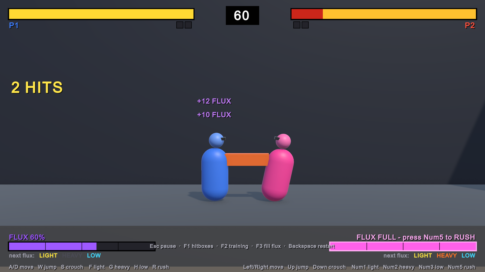

# FighterGameDemo: een mechanic prototypen met Unity MCP

Dit project laat zien hoe snel je een game-mechanic kunt prototypen als je een AI-assistent via [Unity MCP](https://github.com/CoplayDev/unity-mcp) direct in de Unity Editor laat werken. Het is bedoeld voor studenten die aan een fighting game werken. In de eerste sprint wil je zo snel mogelijk ontdekken **welke mechanics leuk zijn**, en dit soort prototypes kan dat proces flink versnellen.

De hele demo (scripts, scène, prefab, instellingen en een eerste testronde) is gemaakt door Claude Code, die via Unity MCP de Editor bestuurde. Er is geen regel code met de hand geschreven.

## Gameplay-video

▶ [Bekijk de gameplay-video (MP4, 6,7 MB)](Docs/FighterGameDemo.mp4)

## De mechanic die we testen: flux

Een lokale 1-tegen-1 fighter met twee identieke vechters op één toetsenbord. De twist:

- **Afwisselen levert flux op.** Raakt je aanval (geraakt óf geblokt) en is het een *ander* type dan je vorige aanval die raakte? Dan krijg je flux: Light +8, Low +10, Heavy +12. Een geblokte aanval geeft de helft.
- **Herhalen levert niets op.** Twee keer Light achter elkaar geeft 0 flux. Een popup laat zien wat je kreeg ("+10 FLUX" of "REPEAT – no flux"), en onder je balk staat welke aanvallen de volgende keer flux opleveren.
- **Volle balk = Rush.** Een snelle dash. Raakt hij, dan volgt een combo van 5 hits (320 schade). Wordt hij geblokt of mist hij, dan sta je wijd open voor een counter.

Voor de rest zijn de klassieke basisregels van het genre gebruikt: blokken door naar achteren te houden, high/low-mixups, chain-combo's, knockdowns, best of 3 rondes en een timer.

| Aanval | Blokken | Rol |
|---|---|---|
| Light | Staand of gehurkt | Snel, ook bruikbaar als anti-air |
| Heavy | Alleen staand (overhead) | Traag, veel schade |
| Low | Alleen gehurkt | Middel snel, laag |
| Sprongaanvallen | Alleen staand | Overheads |

Raakt je aanval (ook als hij geblokt wordt), dan mag je hem *cancelen* in een aanvalstype dat je in die chain nog niet gebruikt hebt (maximaal Light → Low → Heavy) en daarna in Rush.

## Hoe is dit gemaakt?

- **Tool:** [Claude Code](https://claude.com/claude-code) (desktop-app) met het **Unity MCP**-package ([CoplayDev/unity-mcp](https://github.com/CoplayDev/unity-mcp)). Het MCP-package staat al in `Packages/manifest.json`.
- **Model:** Claude Opus 5.5 (`claude-opus-5-5`), effort-instelling "xhigh".
- **Wat de AI via MCP deed:** C#-scripts aanmaken, de scène opbouwen (vloer, muren, camera), de vechter als prefab maken en voor P2 hergebruiken, een ScriptableObject met instellingen aanmaken, referenties koppelen, Play mode starten, console-errors lezen en screenshots maken om het resultaat te bekijken.
- **Zelf testen:** de AI stuurde de simulatie frame voor frame aan en simuleerde toetsaanslagen om te controleren of alles werkte: chains, flux-bedragen, blokken high/low, Rush en de rondeflow. Daarbij vond en repareerde hij zelf drie bugs, waaronder dat Light geen springende tegenstander kon raken (geen anti-air).
- **Tijd**: Alles bij elkaar kostte 75 minuten.

### De gebruikte prompt

De originele prompt (letterlijk overgenomen, in het Engels):

> I want you to create a demo of a fighter game with primitives. The goal of the demo is to test local vs mode. Two of the same fighters. The twist is that alternating between attacks gives you a currency called flux. If the flux bar is full, you can perform a special attack.
>
> Don't focus too much on how it looks, I just want to test if this mechanic is fun. For all the other mechanics you can go with the tried and true basics and staples of the genre.
>
> Ask me a few questions before you start.
>
> Use the Unity MCP.
>
> I want to play with two players using a single keyboard.

Omdat de prompt daarom vroeg, stelde de AI eerst vier meerkeuzevragen. De gekozen antwoorden:

| Vraag | Antwoord |
|---|---|
| Wat telt als "afwisselen"? | Aanval raakt (hit of block) én is een ander type dan de vorige; geblokt geeft minder |
| Wat is de special attack? | Rush super: snelle dash, multi-hit bij raak, kwetsbaar bij block/mis |
| Welke aanvallen? | Light / Heavy / Low (met high/low-mixups) |
| Toetsenbordindeling? | Volledig toetsenbord met numpad |

**Tip:** laat de AI altijd eerst vragen stellen. Zo neem je zelf de ontwerpbeslissingen die ertoe doen, in plaats van dat de AI ze stilletjes voor je invult.

## Waarschuwing: wegwerp-prototypes

Deze werkwijze is heel sterk om **snel een idee te testen**, maar heeft duidelijke nadelen:

- **Gooi het prototype daarna weg.** Gebruik het om te beslissen óf een mechanic werkt, en bouw hem daarna zelf opnieuw in je echte project. Bouw je game niet verder op deze code.
- **Je leert er weinig van over Unity.** De AI heeft de scène, prefabs en scripts gemaakt, dus jij hebt niet geoefend met hoe je dat zelf doet.
- **Je bent geen eigenaar van je codebase.** Je weet niet precies hoe alles in elkaar zit of waarom het zo is gebouwd. Daardoor wordt elke aanpassing moeilijker, en ben je voor elke wijziging weer afhankelijk van de AI.
- **De AI neemt ontwerpkeuzes voor je.** Een voorbeeld: dat Heavy een overhead is, was een keuze van de AI en niet van ons. Zulke details bepalen mede of de mechanic leuk voelt, dus lees ze na (Esc in het spel toont de regels).
- **Of iets leuk is, moet je zelf uitzoeken.** De AI kan testen of de code klopt, niet of het spel leuk is. Laat echte spelers het proberen.

## Spelen

1. Open het project in **Unity 6000.5** (URP, Input System).
2. Open de scène `Assets/Scenes/FluxFighter.unity` en druk op **Play**.
3. **Klik één keer in de Game view**, anders krijgt het spel geen toetsenbordinvoer.

| | Lopen | Springen | Hurken | Light | Heavy | Low | Rush |
|---|---|---|---|---|---|---|---|
| **P1** | A / D | W | S | F | G | H | R |
| **P2** | ← / → | ↑ | ↓ | Num1 | Num2 | Num3 | Num5 |

Blokken = naar achteren houden (weg van de tegenstander). Zet voor P2 **NumLock aan**.

| Toets | Functie |
|---|---|
| Esc / P | Pauze + uitleg van de regels |
| F1 | Hitboxes tonen |
| F2 | Trainingsmodus (geen timer, levens vullen zich weer aan) |
| F3 | Beide fluxbalken vullen (om Rush te testen) |
| Backspace | Match herstarten |

Na elke match zie je **statistieken** per speler: hoe vaak ze afwisselden, hoeveel flux ze verdienden en hoe hun Rushes afliepen. Zo zie je of de mechanic het gedrag van spelers echt verandert.

### Tunen

Alle getallen staan in één bestand: `Assets/Data/FighterConfig.asset`. Denk aan flux per aanval, de flux-multiplier bij blokken, frame data en Rush-schade. Wijzigingen die je tijdens Play mode maakt blijven bewaard, dus je kunt tussen rondes door tweaken en meteen opnieuw testen.
